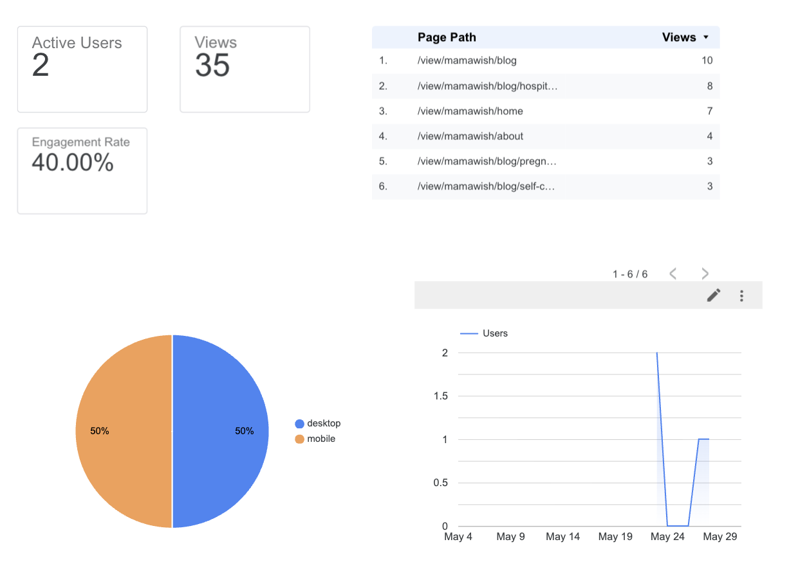

# Introduction

MamaWish is a blog website focused on pregnancy wellness, motherhood, and self-care resources for expecting mothers and new mothers.

The purpose of this report is to evaluate the initial website performance using Google Analytics and summarize key insights obtained after launching the website.

# Traffic Overview

Google Analytics, Google Search Console, BigQuery, and Looker Studio were connected to the website to monitor user activity and website performance.

The dashboard below summarizes website traffic, engagement, page performance, and device usage.

# Key Findings

## User Activity

The website generated 35 page views from 2 active users during the initial data collection period.

Although traffic volume is still relatively small because the website was recently launched, the data confirms that users are actively navigating through multiple pages on the site.

## Content Performance

The Blog page received the highest number of views with 10 page views, making it the most visited section of the website.

Among individual blog posts, the Hospital Bag Essentials article generated strong engagement with 8 page views. This suggests that practical pregnancy-related content may be particularly appealing to the target audience.

The Home page received 7 views, while the About page received 4 views.

## Device Usage

Website traffic was evenly split between desktop and mobile devices, with each accounting for 50% of total users.

This finding highlights the importance of maintaining a mobile-friendly website design since a significant portion of visitors may access content through smartphones.

## Engagement

The website achieved an engagement rate of 40%.

This indicates that visitors interacted with the website content rather than immediately leaving the site. While additional traffic is needed for more reliable conclusions, the engagement rate suggests that the content is relevant to visitors.

# Recommendations

Based on the initial analytics results, several opportunities exist to improve website growth and engagement:

-   Publish additional blog posts focused on pregnancy wellness and motherhood topics.

-   Continue optimizing content for search engines to increase organic traffic.

-   Promote blog articles through social media platforms to expand audience reach.

-   Monitor Google Search Console data to identify high-performing search queries and content opportunities.

# Conclusion

The MamaWish website successfully implemented Google Analytics, Google Search Console, BigQuery, and Looker Studio to track website performance.

Initial results show that blog content is attracting the most engagement, particularly practical pregnancy-related resources. As more content is published and traffic increases, additional analysis can be conducted to better understand user behavior and content performance.
